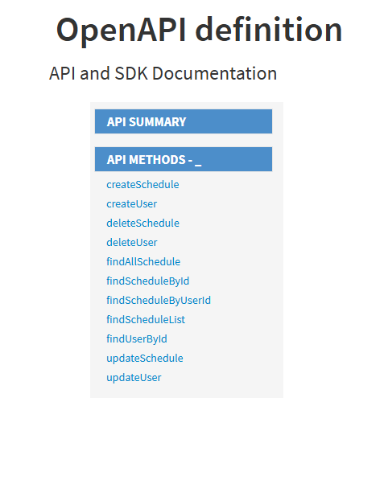
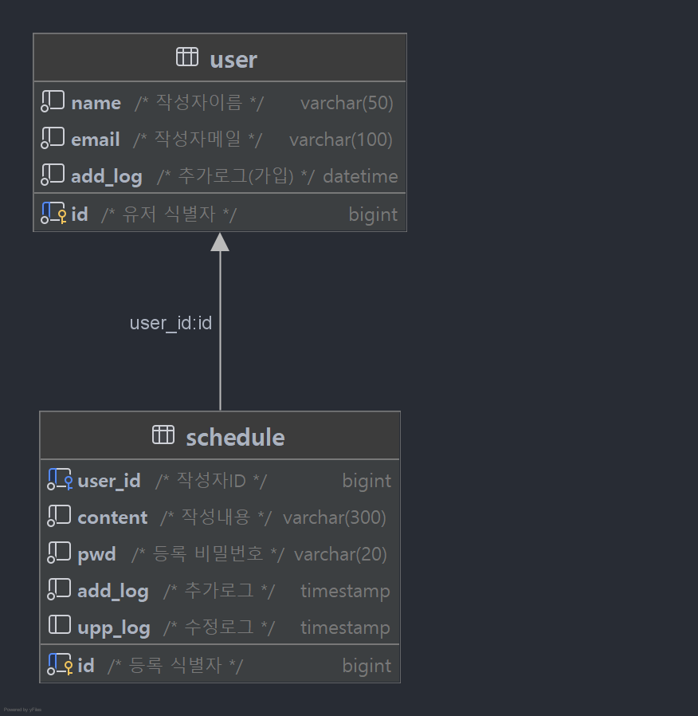

### [ Spring 입문 프로젝트 ]

## 개발 환경
> IDE : IntelliJ IDEA Community Edition  
> JDK : OpenJDK 17  
> SpringBoot : 3.3.3

## 디렉토리 구조

```md
src
├── ScheduleApplication.java  // 메인 애플리케이션
├── controller
│   ├── schedule
│   │   └── ScheduleController.java  // Schedule API 엔드포인트
│   └── user
│       └── UserController.java      // User API 엔드포인트
├── dto
│   ├── schedule
│   │   ├── ScheduleRequestDto.java   // Schedule 요청 DTO
│   │   └── ScheduleResponseDto.java  // Schedule 응답 DTO
│   └── user
│       ├── UserRequestDto.java       // User 요청 DTO
│       └── UserResponseDto.java      // User 요청 DTO
├── entity
│   ├── schedule
│   │   └── Schedule.java  // 스케줄 엔티티
│   └── user
│       └── User.java      // 유저 엔티티
├── exception
│   ├── CustomException.java          // 커스텀 예외
│   ├── ExceptionDto.java             // 예외 응답 형식
│   ├── ExceptionErrorCode.java       // 에러 코드 정의
│   └── GlobalExceptionHandler.java   // 전역 예외 처리
├── repository
│   ├── schedule
│   │   ├── JdbcTemplateScheduleRepository.java  // JDBC Schedule 구현체
│   │   └── ScheduleRepository.java             // 인터페이스
│   └── user
│       ├── JdbcTemplateUserRepository.java     // JDBC Schedule 구현체
│       └── UserRepository.java                 // 인터페이스
└── service
├── schedule
│   ├── ScheduleService.java      // Schedule 서비스 인터페이스
│   └── ScheduleServiceImpl.java  // 구현체
└── user
├── UserService.java             // User 서비스 인터페이스
└── UserServiceImpl.java         // 구현체
```

## API 문서 - 바로가기
[](https://sw00y.github.io/ch3-schedule/)

## ERD


## 트러블 슈팅 및 예외처리

<details>
<summary style="font-size: 16px;"><strong>DB DATETIME DATA <-> JSON DATE DATA </strong></summary>

1. 문제상황
- DB에 저장하는 add_log, upp_log 가 있다.
  > add_log = 추가(INSERT)시점  
  > upp_log = 수정(UPDATE)시점

- 다음과 같이 현재 시간을 저장하고, DB에 입력된다.
  `Timestamp.valueOf(LocalDateTime.now())`

- DB에 입력된 값은 현재시간에 맞게 잘 저장되었으나 DB에 저장된 log를 출력해보니
  > DB에 저장된 데이터 : `2025-03-25 03:12:43`
  > 출력된 데이터 : `"add_log": "2025-03-24T18:12:43.000+00:00"`

- 저장된 값과 API에서 반환된 값이 서로 달랐다.

2. 원인분석
- JDBC의 Timestamp 저장 방식
  > `Timestamp.valueOf(LocalDateTime.now())`를 사용하면 서버의 시스템 시간대를 따라 DB에 저장된다.
- Spring Boot의 JSON 변환 방식
  > Spring Boot에서 `LocalDateTime`을 JSON으로 변환할 때 기본적으로 UTC(협정 세계시) 기준으로 변환(-> Jackson 직렬화)한다.

**JDBC는 KST기준으로 정상적으로 저장했지만 JSON 변환 시 UTC 기준으로 직렬화 되면서 포맷, 시간의 차이가 발생했던 것이다.**

3. 해결방법

- 굉장히 간단한 방법으로 처리가 가능했다.
> `application.properties` 에 아래 내용을 추가했다.
>
> `spring.jackson.date-format=yyyy-MM-dd HH:mm:ss`
> `spring.jackson.time-zone=Asia/Seoul`

적용 후 결과 : `"add_log": "2025-03-25 03:12:43"`

4. 문제점
- 외국 사용자가 사용할 가능성이 있다면 UTC로 저장 후 클라이언트에서 변환하는 방식이 필요할듯..
</details>

<details>
<summary style="font-size: 16px;"><strong>HttpStatus Message, Code 관리</strong></summary>

Service의 예외처리를 우선 별도의 메소드로 관리했다.

```java
/*******************************
 * 예외처리 위한 메소드 목록
 *******************************/

/*******************************
 * 찾고자 하는 id의 일정이 존재하지 않는 경우 예외처리
 *******************************/
private Schedule getScheduleOrThrow(Long id) {
    return scheduleRepository.findScheduleById(id)
            .orElseThrow(() -> new CustomException(ExceptionErrorCode.SCHEDULE_NOT_FOUND));
}

/*******************************
 * 수정/삭제의 id,pwd가 일치하지 않을경우, 해당 id가 존재하지 않을 경우 예외처리
 *******************************/
private void validatePassword(Long id, String pwd) {
    Optional<String> storedPwd = scheduleRepository.findUserPwd(id);

    if(storedPwd.isEmpty()){
        throw new CustomException(ExceptionErrorCode.SCHEDULE_NOT_FOUND);
    }

    if (!storedPwd.get().equals(pwd)) {
        throw new CustomException(ExceptionErrorCode.PASSWORD_ERROR);
    }
}

/*******************************
 * 일정의 userId값으로 조회 시 없는경우 예외처리
 *******************************/
private String findUser(Long id) {
    Optional<String> userName = scheduleRepository.findUserName(id);

    if(userName.isEmpty()){
        throw new CustomException(ExceptionErrorCode.USER_NOT_FOUND);
    }

    return userName.get();
}
```

Service에서 진행한 예외처리 외에도 ScheduleRequestDto에서 유효성 검사를 진행했다.

```java
private Long user_id;
private String name;

@NotBlank(message = "REQUEST_DTO_ERROR_CONTENT_NULL")
@Size(max = 200, message = "REQUEST_DTO_ERROR_SIZE_200")
private String content;

@NotBlank(message = "REQUEST_DTO_ERROR_PWD_NULL")
private String pwd;

private Timestamp add_log;
private Timestamp upp_log;
```

여러가지 예외처리 사항을 편하게 관리하고, 커스텀 예외처리를 진행하고 싶었다.

- RuntimeException을 상속받는 CustomException Class
```java
public class CustomException extends RuntimeException {
    /*******************************
     * 커스텀 예외클래스
     * HTTP 상태코드, 에러멤시지
     *******************************/

    private final HttpStatus status;

    public CustomException(ExceptionErrorCode exceptionErrorCode) {

        super(exceptionErrorCode.getMessage());
        this.status = exceptionErrorCode.getStatus();
    }

    public HttpStatus getStatus() {
        return status;
    }
}
```

- 반환에 사용할 Dto
```java
public class ExceptionDto {
    private int status;
    private String message;
}
```

- 예외처리 enum
```java
public enum ExceptionErrorCode {
    CONTENT_NULL(HttpStatus.BAD_REQUEST, "작성내용이 없습니다."),
    SCHEDULE_NOT_FOUND(HttpStatus.NOT_FOUND, "조건에 맞는 일정이 없습니다."), 
    REQUEST_DTO_ERROR_SIZE_200(HttpStatus.BAD_REQUEST, "내용은 200자 이내로 작성해야합니다."),
    REQUEST_DTO_ERROR_PWD_NULL(HttpStatus.BAD_REQUEST, "비밀번호는 필수값 입니다.");
    ... 생략
} ... 생략
```
```
- enum에는 설정된 에러메세지(CONTENT_NULL 등)로 HttpStatus를 가지고온다.
- GlobalExceptionHandler 에서 예외처리를 진행
```

- GlobalExceptionHandler (전역 예외처리 컨트롤러)
```java
@RestControllerAdvice
public class GlobalExceptionHandler {
    /*******************************
     * 전역 예외처리 핸들러 JSON응답으로 반환
     * @param e (CustomException) = 발생한 커스텀 예외클래스 객체
     * @return ExceptionDto(상태코드 + 메세지)
     *******************************/

    @ExceptionHandler
    public ResponseEntity<ExceptionDto> handle(CustomException e) {

        ExceptionDto exceptionDto = new ExceptionDto(e.getStatus().value(),e.getMessage());
        
        return ResponseEntity.status(e.getStatus()).body(exceptionDto);
    }

    /******
     * ScheduleRequestDto의 조건에 따른 예외처리 부분
     * @param e (MethodArgumentNotValidException) Dto 유효성 검사
     * @return ExceptionDto(상태코드 + 메세지)
     */
    @ExceptionHandler(MethodArgumentNotValidException.class)
    public ResponseEntity<ExceptionDto> handleRequestDto(MethodArgumentNotValidException e) {

        String errorCode = e.getFieldError().getDefaultMessage();

        ExceptionErrorCode code = ExceptionErrorCode.valueOf(errorCode);

        ExceptionDto exceptionDto = new ExceptionDto(code.getStatus().value(), code.getMessage());
        return ResponseEntity.status(code.getStatus()).body(exceptionDto);
    }
}
```
    - handle : Service에서 던지는 예외처리
    - handleRequestDto : RequestDto의 유효성 검사
      > RequestDto 유효성 검사의 message를 가지고 enum에서 받아온다.

- 결과
```json
{
    "status": 400,
    "message": "내용은 필수값입니다."
}
```
</details>
